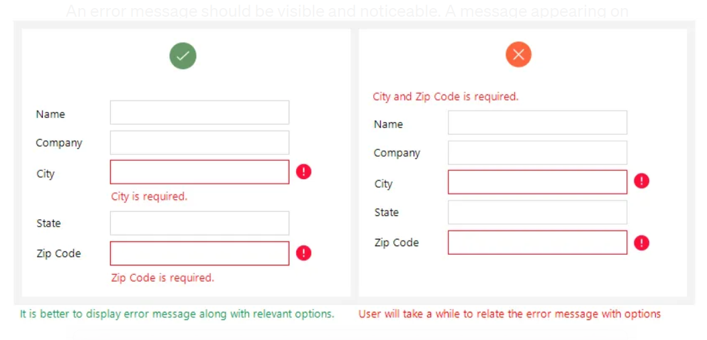
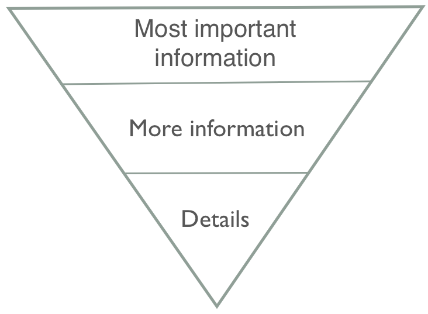
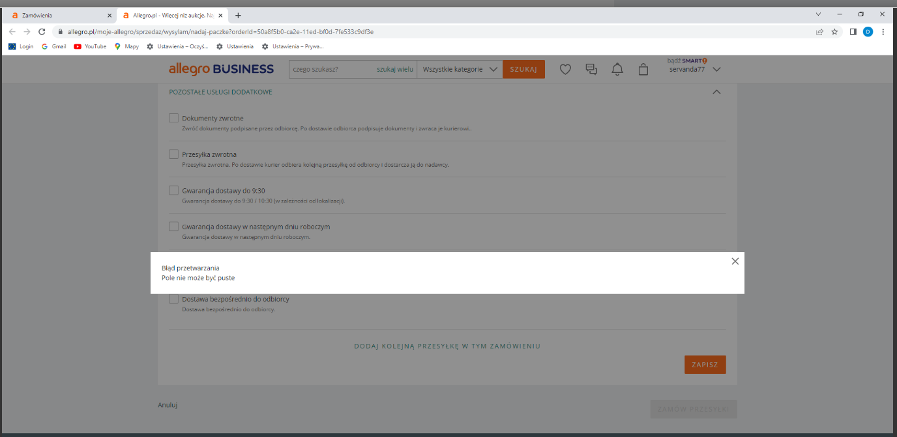
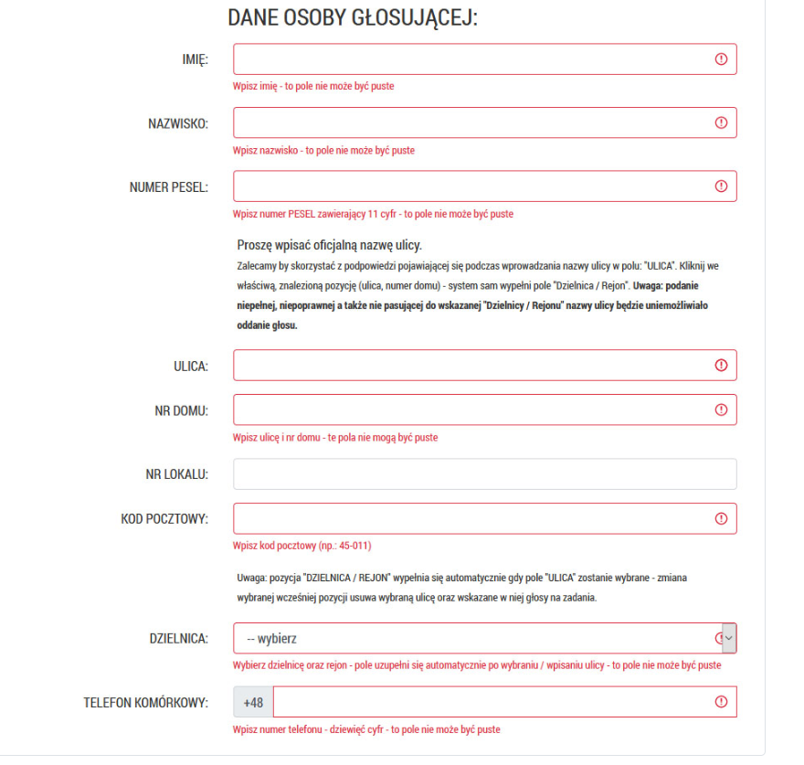
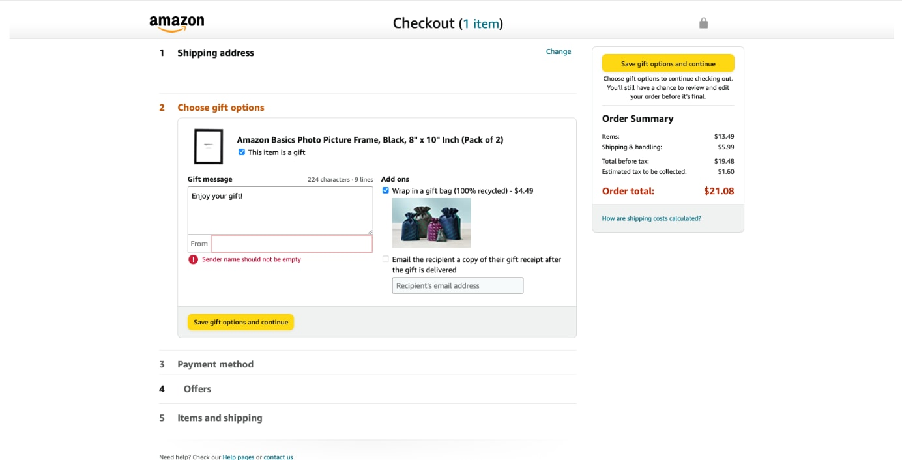

The basic idea is to think of potential errors during the process of creating the application and not after it is implemented. This will help you prepare different scenarios for various error situations. What is more, you may even be able to eliminate errogenic situations from your product.

You have to make it clear that the error occured (visibility of system status). 

Give solution and explain what happened. It is critical for the user to deal with the problem first. 

przykłady, ale są też wyjątki (np komunikat microsoft z wojtka Aleksandra)

"Error messages should be expressed in **plain language** (no error codes), precisely indicate the problem, and constructively suggest a solution.

As Wojciech Aleksander points out in his "UX writing. Moc języka w produktach cyfrowych",when you write an error message it is best to use *inverted pyramid*:

The most improtant information is how to solve the problem.

Then you can explain what happened, and finally, you may provide the user with some details, eg. what brought the error about.

Compare these two messsages:

The first one only communicates about the error without any expalanation what went wrong, what is missing and how to enter the correct data.

The second one, on the other hand, gives the solution first, and then informs that the error occurred.

In the example above you can notice that error messages should be also presented with visual treatments that will help users spot and recognize them.

Conventionally, use bold text and highlights, high-contrast and red color (as in the message above) for the affected elements that require correction. 

However, remember that for about 350 million people worldwide with a color-vision deficiency, this may not be enough and, therefore, apply the animation to indicate errors as well.

Z Wojtka aleksandra o podpowiedziach w wyszukiwarce

**use confirmative sentences**

**Give alternative solutions** (Wojtek - nie zostawiaj na lodzie)

!!!!!!youtube video: provide helpful constraints so that the user is limited to scenarios in which they can face an error message!!!!!