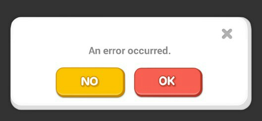

# What are error messages #

In a nutshell, an error message is a piece of text that tells the users that the action they took didn't not succed.  Sometimes it is quite explanatory presenting the steps that the user should take to proceed with his or her work. However, there happen messages like this 

or that

 
making your users frustrated because they it is vague and it doesn't explain what to next. 

Let's be honest, how much of your attention while creating new software do you pay to the possibility of error occurance?
You probably mostly concentrate on the part that should go well and not on the part that should go wrong.

Nevertheless, you build a product for the customer who will spend quite a lot of money on it, and if so, bare in mind that errors are inevitable. To make the product more customer-friendly you need to prepare well-written and efficient error messages.

In this manual you will find many useful tips and ideas how to handle the problem